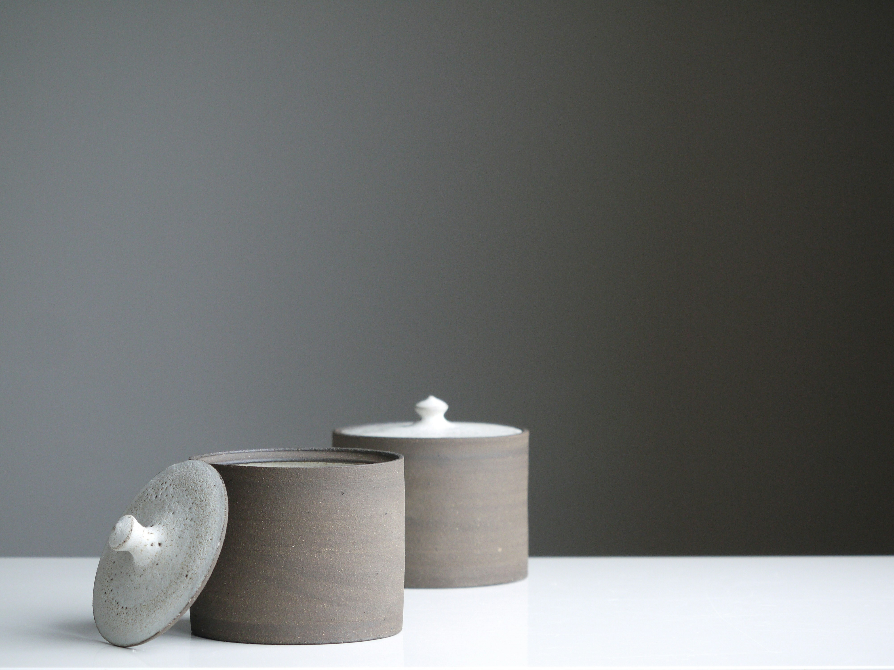
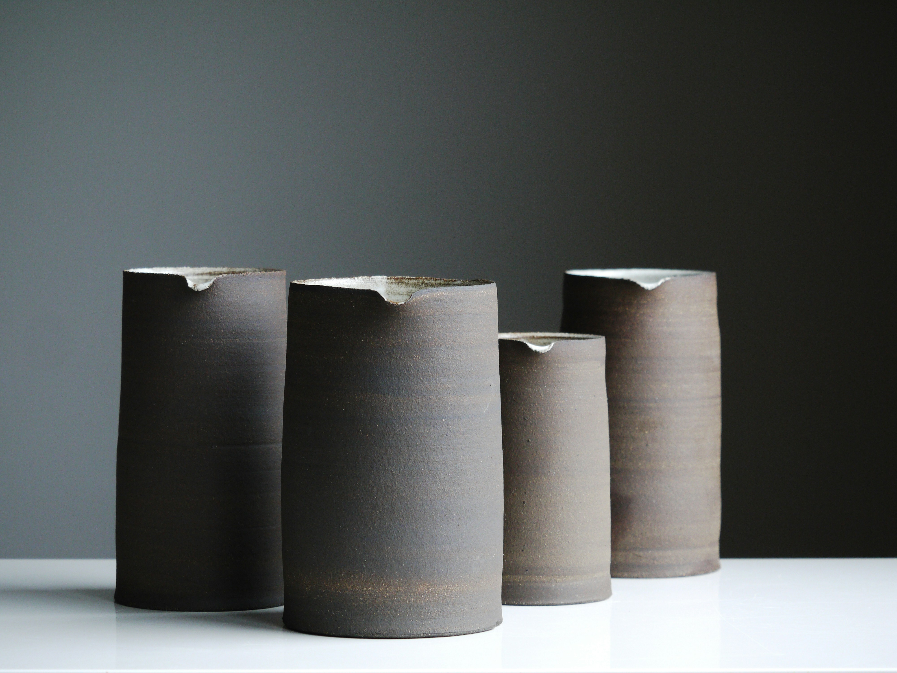
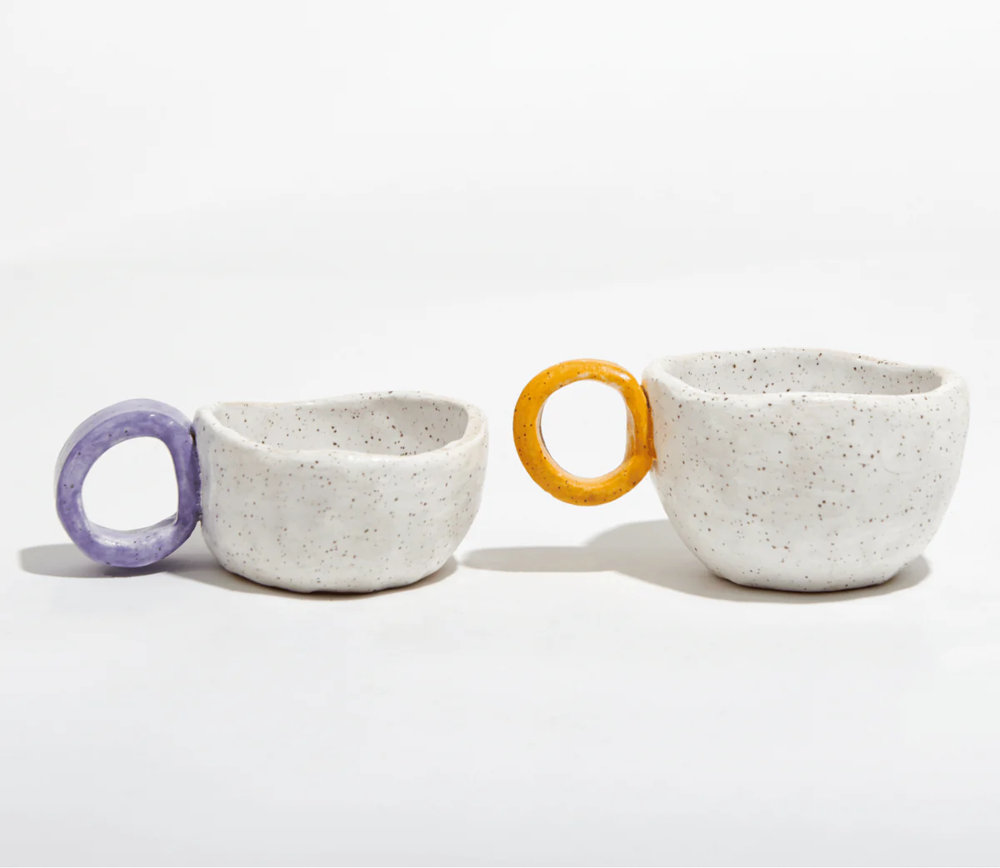

basic page design to live

 <!-- Testing area -->

<!-- Gallery Section -->

    

        <!-- First Image Column (Image 1) -->
        

            
        

        <!-- Second Column with Nested Images (Image 2, Image 3, Image 4) -->
        

            <!-- Image 2 (top-right for medium screens) -->
            

                
            

            <!-- Image 3 and Image 4 (bottom-right for medium screens) -->
            

                

                    
                

                

                    
                

            

        

    

our section

<!-- Our Story Section -->

    <!-- Background Image with Overlay -->
    

        
        

    

    <!-- Centered Text Content -->
    

        <h1 class="text-4xl font-bold text-white">Our Story</h1>
        

            Lorem Ipsum has been the industry's standard dummy text ever since the 1500s, when an unknown printer
            took a galley of type and scrambled it to make a type specimen book.
        

    

<!--
  -->
